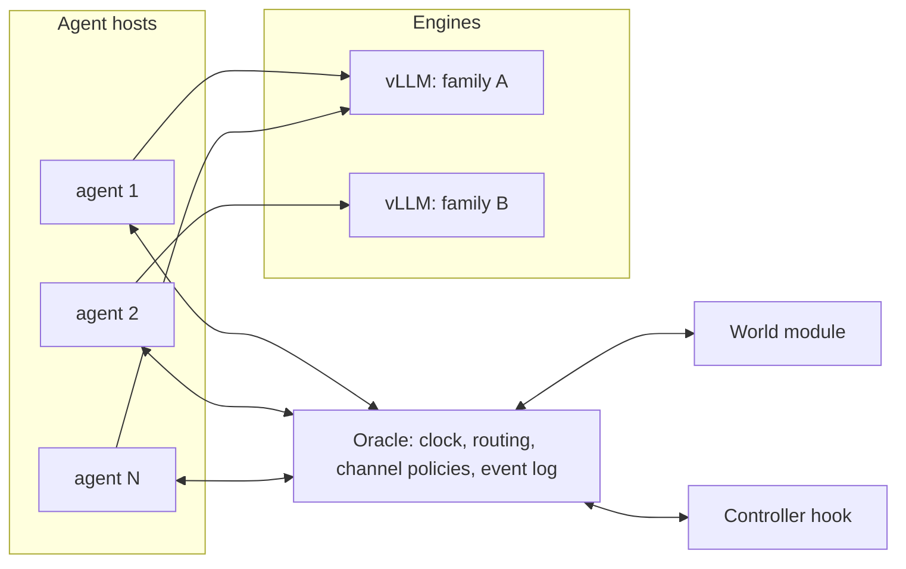

# Platform specification: multi-principal language-model agent populations

Version 0.1, October 2026. Owner: J. Introne. Audience: the doctoral student building the launch container and oracle.

## Purpose

The platform runs populations of 8 to 512 language-model agents, deployed under distinct principals, against a shared simulated world, and records what is needed to fit dynamical models offline. Runs execute as unattended batch jobs. Nothing is inspected or adjusted while a run executes, so every experimental manipulation is declared in configuration and every observable is written to disk.

The first use is a pilot with 32 to 64 agents in a communicating El Farol game with an exogenous news stream, followed by a minimal call market. The platform makes no assumption about either domain; domains enter as world modules.

## Architecture



- **Oracle:** owns the simulation clock, the world module, and all routing. Every interaction between an agent and the world, and between two agents, passes through it. It applies channel policies (latency, cost, availability, rate limits), executes interventions, and writes the event log.
- **World module:** a plug-in that holds domain state and implements observations, world tools, actions, clearing, and ground-truth metrics. The oracle calls it; it never communicates with agents directly. The full interface is specified in a separate kernel document; the contract is summarized below.
- **Agent host:** a process running one or more agent clients. Each client holds one recipe, its own memory, and a connection to the oracle. Clients call inference engines directly.
- **Inference engines:** vLLM servers, one per model (typically one per model family), shared across agents. Recipes reference engines by name.

Agent identity lives in the recipe: prompt, tools, memory, and any private knowledge store. An engine carries no agent state, and several principals may share one engine.

## Clock modes

Each run selects one of three modes. Comparing modes is itself an experimental question, so the modes share one code path wherever possible.

**sync.** Time advances in rounds. At round open the oracle sends a wake to every agent. Agents act within the round, and the oracle closes it when every agent has submitted a final action or the round deadline passes. An agent that misses the deadline receives the world's default action, logged as a timeout. The world clears once per round.

**async-virtual.** A discrete-event kernel on a virtual clock, following the design of the ABIDES kernel. Each agent request carries the agent's current virtual time. When an agent finishes a language-model call, its virtual clock advances by a charged compute delay taken from a declared cost model (for example, a fixed overhead plus a per-output-token rate for each engine). The oracle processes events in virtual-time order and advances the global clock to the next event only when no agent is still computing at an earlier virtual time. Wall-clock speed has no effect on outcomes in this mode, so runs are comparable across hardware and load. The compute delay can be set per principal, which gives a speed lever independent of the hardware.

**async-wall.** Virtual time equals wall time multiplied by a constant. Inference speed, batching, and engine contention affect outcomes directly. Agents that share an engine are coupled through its queue, so engine assignment and queue depth are logged (see Inference engines).

## Observation timing and staleness

An agent sees the world only through channels, and each channel delivers the world state as of some earlier time. Agents in the async modes act on different, aging views of the world, and channel latency is the primary control lever. Staleness is therefore a designed and measured quantity.

Every delivered observation records the world time its content reflects and the time it reached the agent. Every action records the world times of the observations the agent conditioned on (reported by the agent harness) and the time the action reached the oracle. With these fields, staleness is computable per event in every mode.

In sync mode with zero latency, every agent sees the state at round open. Latency in sync mode is expressed in rounds.

## Channels and routing

The oracle routes typed envelopes:

- **observe:** a pull of world state through a named world channel (price, attendance history, order book summary).
- **tool_call / tool_result:** a request to a world-provided source (a news feed, a data query), with its reply.
- **message:** agent to agent, or agent to group, along edges that the communication topology permits. Each message has a maximum length, and each agent has a message budget per round or per unit of virtual time.
- **action:** a submission to the world (an order, a go or stay decision).
- **control:** oracle to agent: start, wake, stop, and notices the world chooses to expose (for example, a change in a source's price).

Every world channel and every message edge carries a policy with four parameters: latency (a distribution in simulation time), cost (debited from a per-agent budget whose currency the world defines), availability (on or off), and rate limit. A policy can be set globally, per class, per principal, or per agent, and it changes only through the intervention schedule or the controller hook. The oracle implements latency by scheduling the delivery event at the delayed time. The transport never sleeps.

**Principal-private tools** (a retrieval store, a calculator, a scratchpad) run inside the agent and bypass the oracle. The overseer holds no lever over them, which matches a deployment where an operator cannot reach a firm's internal resources. The agent logs every private tool call with its timing, and in async-virtual mode the cost model charges that time.

## Load and transport

A rough upper bound for one 64-agent round is about 10 envelopes per agent (one observation, a few tool calls, a few messages, one action), so under 1,000 envelopes of a few kilobytes each. A round takes seconds of inference, so the transport carries at most hundreds of envelopes per second, well inside what any socket library handles. The 4,096 ordered pairs bound who may talk; message budgets bound how much they do. At 512 agents the volume grows roughly tenfold and stays well inside transport limits. Inference is the bottleneck by several orders of magnitude.

The transport must provide:

- one bidirectional connection per agent, or per agent host multiplexed by agent id, so the oracle can push control messages and agents can make requests;
- the oracle as sole router, with no connections between agents;
- request and reply correlation by envelope id, so the oracle can hold a reply to apply latency;
- no broker process or persistence layer, since the oracle's event log is the record.

ZeroMQ ROUTER/DEALER sockets over TCP meet these requirements with little code. Websockets on an asyncio server are an acceptable alternative. Kafka, RabbitMQ, and similar brokers add operational weight with no benefit here.

## Envelope schema

```json
{
  "id": "uuid",
  "run_id": "str",
  "type": "observe | tool_call | tool_result | message | action | control | ack",
  "src": "agent_id | oracle",
  "dst": "agent_id | group_id | oracle | world",
  "channel": "str",
  "t_sent": 0.0,
  "t_delivered": null,
  "t_sent_wall": 0.0,
  "reflects_t": null,
  "conditioned_on": ["envelope ids"],
  "reply_to": null,
  "call_ids": ["transcript entry ids"],
  "cost": null,
  "payload": {}
}
```

Times without a suffix are simulation times (rounds in sync mode, virtual seconds in the async modes). The oracle logs every envelope at receipt and again at delivery, or at drop with a reason (unavailable channel, budget exhausted, rate limit, timeout).

## Agents and recipes

A recipe is a declarative file delivered to the agent host at startup. Its fields:

- **identity:** agent_id, principal_id, class labels.
- **policy:** one of `llm` (engine name, sampling parameters, prompt templates), `rule` (a named rule-based policy with parameters), or `layered` (a language model issuing directives to a rule-based executor that acts at a faster cadence, the arrangement the proposal uses for trading).
- **tools:** the world tools the agent may call, by name, and its private tools with their configuration.
- **memory:** type (rolling self-written summary, window of the last k events, or retrieval over the agent's own history) and size limits.
- **randomization:** an optional ε for decision-level action flips. When it is set, both the intended and the executed action are logged.
- **persona and priors:** free text plus structured fields kept for analysis.
- **seed.**

The pilot needs four built-in policies: `llm`, calibrated random, zero-intelligence, and a simple trend follower. Rule-based agents use the same protocol, so mixed populations need no special handling.

**Knowledge stores.** A principal may equip its agents with a private retrieval index, so that different principals hold different knowledge. The recipe declares a store id and a retriever configuration. Stores are mounted read-only in the container, and their content hashes are logged. The pilot does not require stores, but the schema reserves the field and the agent harness accepts private-tool plug-ins, so stores can be added later without changes to the oracle.

**Harness loop (all modes).** Wait for a wake, observe the allowed channels, read the inbox, make optional tool calls, send optional messages, submit an action or pass, update memory, then sleep until the next wake. In the async modes an agent may request a self-wake at a virtual time, and the world may wake agents on events such as a fill.

**Structured output.** The harness enforces a JSON schema for each response through guided decoding. A parse failure gets one retry and then the default action; both are logged.

## Inference engines

The run configuration declares each engine: name, model id pinned to a revision hash, dtype, maximum context length, GPU memory fraction, and tensor-parallel size. The container image pins the vLLM version.

On the H200 (141 GB), several 8B engines can share one card. Four families at a memory fraction of about 0.2 each leave room for weights plus KV cache for 64 concurrent short contexts; this needs to be measured on the card during calibration. Larger models get dedicated cards through tensor parallelism, with no change to recipes. Per-principal LoRA adapters on a shared base model are reserved for later.

The oracle logs each agent's engine assignment. In async-wall mode, the launcher samples each engine's queue depth and running-request count once per second and writes them to the log.

## Interventions and controller hook

**Intervention schedule.** A list of entries, each with a time, a selector (agents, principals, classes, or all), a channel, and a policy change. The oracle applies each entry at its scheduled time and logs it as an event.

**Controller hook.** An optional plug-in that the oracle calls at a declared cadence, with read-only access to the event history and world metrics, and that returns policy changes. The pilot leaves it empty. Fixing the interface now lets closed-loop control (Aim 3) run without changes to the oracle.

## Run configuration and launch

One YAML file defines a run, optionally as a base file plus overrides. It contains the run id, clock mode and its parameters, termination (a fixed duration in rounds or virtual time), the world module and its configuration, engines, recipes (inline or by path), communication topology, channel policies, the intervention schedule, the controller, seeds, and logging options. The launcher resolves overrides, then hashes the resolved configuration and every referenced file (recipes, prompt templates, stores) and writes the hashes to the output.

The container entrypoint is `simrun --config run.yaml --out /out`. It runs these steps in order:

1. Resolve and hash the configuration.
2. Start the engines and wait for health checks.
3. Start the oracle.
4. Start the agent hosts, deliver recipes, and wait for every agent to report ready.
5. Send start, run to termination, send stop.
6. Flush the logs and write the run summary.
7. Shut down. Exit 0 on completion; on failure, exit nonzero with the reason in the summary.

**Sweeps.** A sweep file lists a base configuration, a grid or list of overrides, and seeds. A sweep expander writes one resolved configuration per run, and the cluster scheduler runs them as independent jobs.

## Outputs

Each run writes one directory:

- `config.resolved.yaml`, `hashes.json`, `versions.json` (image digest, vLLM version, model revisions, library versions).
- `events.jsonl.zst`: the oracle event log, with every envelope at receipt and delivery, every intervention, and every timeout.
- `world.jsonl.zst`: world state and ground truth at each round or clearing event (for example the fundamental, attendance, price, and book summary), plus world performance metrics.
- `transcripts/{agent_id}.jsonl.zst`: every language-model call (prompt, completion, sampling parameters, token counts, latency, engine), every private tool call, parse failures, memory updates, and intended versus executed actions. Entry ids match the `call_ids` field in envelopes.
- `summary.json`: completion status, duration, envelope counts by type, timeouts, parse failures, tokens by engine, and errors.

The platform writes incrementally and flushes periodically, so a crash leaves a usable partial record. Derived tables (per agent, per tick, in Parquet) are built offline by analysis scripts and are outside the platform.

## Determinism and reproducibility

The world module owns a seeded generator for world randomness (fundamental, news, source noise). Agent randomness (ε flips, rule-based policies) comes from a separate generator seeded per agent, so the exogenous stream is identical across configurations that share a seed. Sampling seeds are passed to vLLM, but outputs are not reproducible across batch compositions; the transcripts are the record.

In sync and async-virtual modes, the oracle and world should reproduce the event log exactly when fed recorded transcripts in place of live inference. A replay tool that does this is a stretch goal and a strong correctness test.

## World module contract

The kernel document specifies the full interface. In summary, a world module implements:

- `init(config, rng)`
- `channels()`: declared observation channels and world tools, with default policies
- `observe(agent_id, channel, t) -> (payload, reflects_t)`
- `tool(agent_id, name, args, t) -> payload`
- `submit(agent_id, action, t) -> ack`
- `advance(t) -> events`: clearing, fills, outcomes, and payoffs, called at round close in sync mode and at scheduled clearing events in the async modes
- `default_action(agent_id)`
- `charge(agent_id, amount)`: budget accounting in the world's currency
- `state(t)`, `metrics(t)`, `ground_truth(t)`: records for the world log

## Acceptance tests

1. A run of 64 rule-based agents, with no engines, completes in all three clock modes and produces complete logs.
2. **Latency:** a channel with latency L delivers observations whose `reflects_t` lags delivery by L, verified from the log in each mode.
3. **Determinism:** two async-virtual runs of rule-based agents with the same seed produce identical event logs.
4. **Mixed population:** 64 language-model agents across at least two engines on the H200 complete 100 rounds of the El Farol world in sync mode, with timeout and parse-failure rates reported in the summary.
5. **Intervention:** a scheduled availability change on a channel appears in the event log and takes effect on the next request.
6. **Failure handling:** killing one agent mid-run produces timeouts for that agent, and the run completes.

## Out of scope for version 0.1

Live dashboards and runtime inspection; private knowledge stores (field reserved); per-principal LoRA adapters; orchestration across nodes beyond what the cluster scheduler provides.